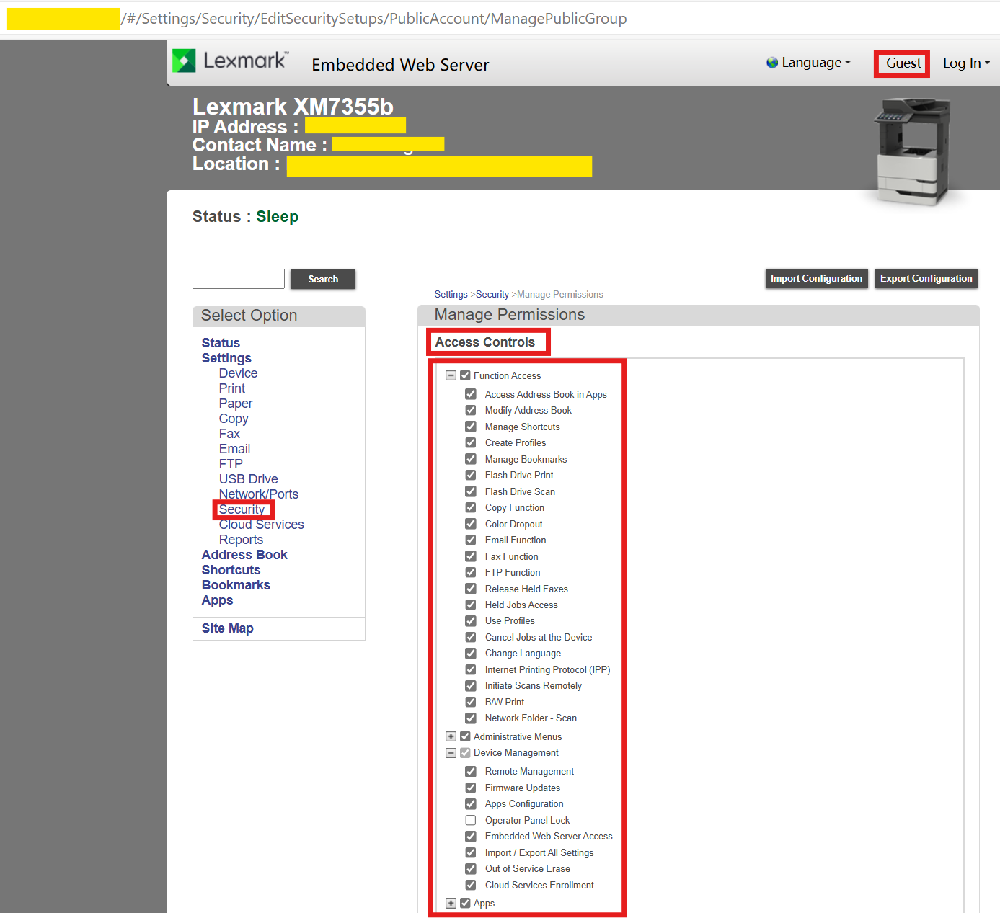
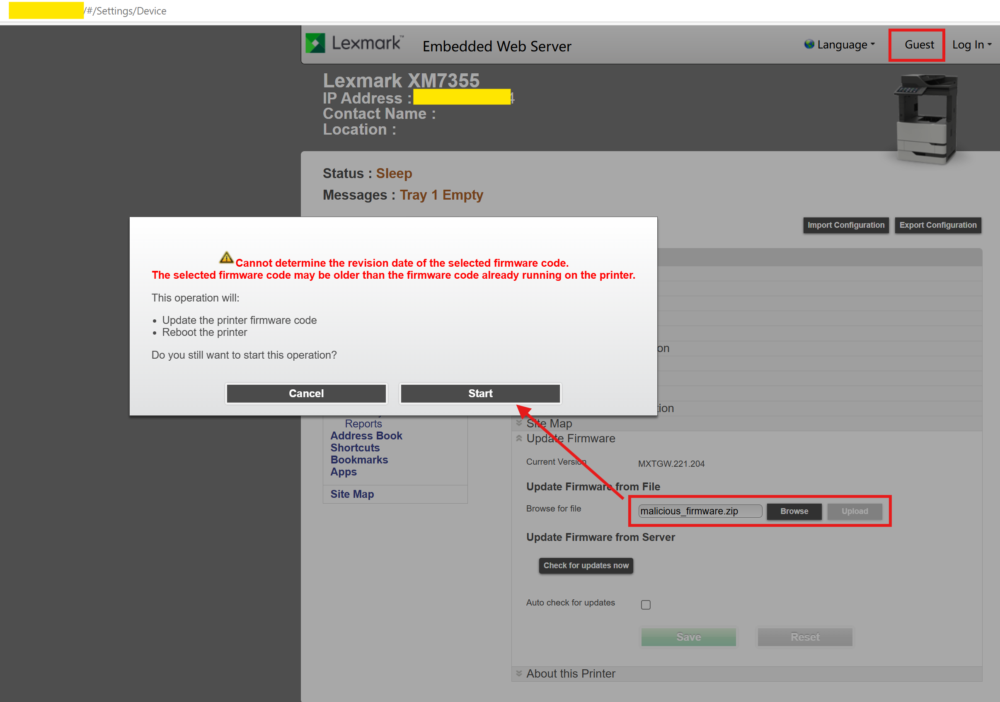
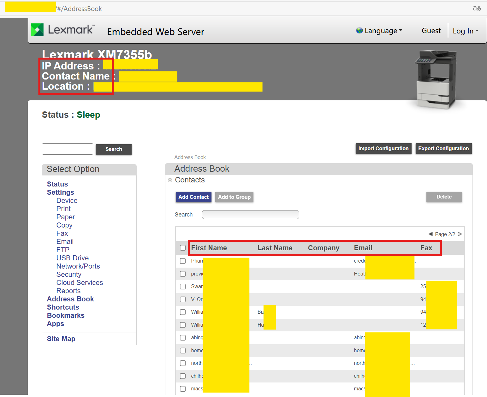
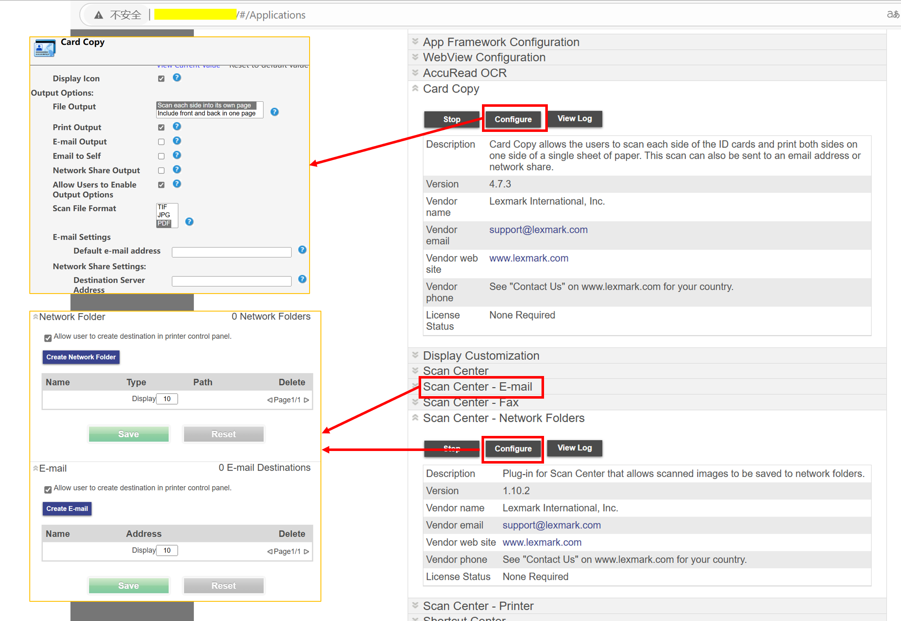

# Vulnerability Overview

A critical Missing Authentication for Critical Function (CWE-306) vulnerability has been identified in multiple Lexmark XM-series printer models (including XM5365, MX522adhe, XC4150, and XM7355). The affected devices expose web interfaces that lack authentication controls, enabling unauthenticated attackers to remotely execute malicious actions. Exploitation of this vulnerability could lead to unauthorized firmware modification, sensitive data leakage, and full compromise of printer functionality.

## The following products and versions are affected:

- XM7355 (Firmware: MXTGW.221.204)
- MX522adhe (Firmware: MXTGM.081.215/MXTGM.240.207)
- XC4150 (Firmware: CXTAT.221.204)
- XM5365 (Firmware: MXTGW.081.234)

# POC:
## Improper Access Control

## Malicious Firmware Upload
Attackers may upload custom or tampered firmware to the printer, enabling persistent control over the device. This could facilitate further attacks on the corporate network or disrupt printer operations.

## Sensitive Data Exposure
Extract internal employee information, including names, email addresses, and fax numbers, stored on the device. This data could be leveraged for social engineering or targeted phishing campaigns.

## Printer Configuration Manipulation
Redirect print/scan jobs to attacker-controlled destinations

